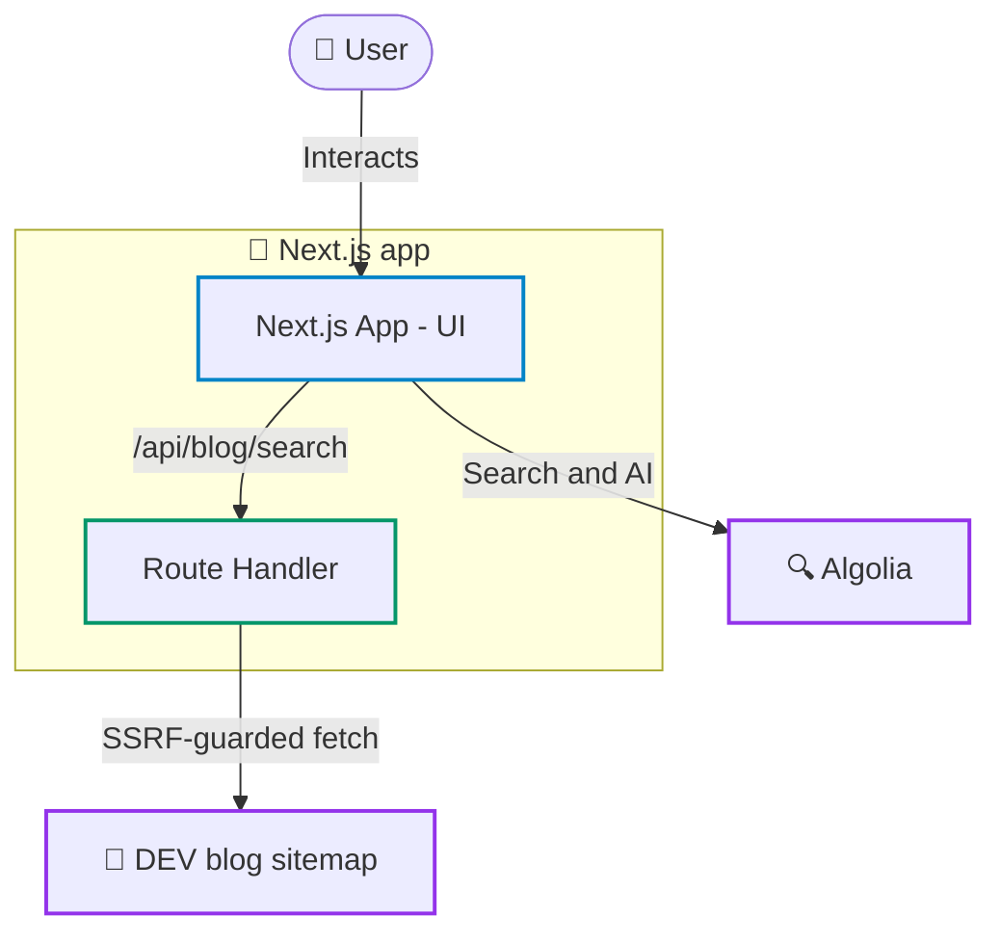

# System Architecture

## Overview

System Notes is a single Next.js app that acts as a "digital nervous system" for a portfolio: a sparkly UI up front, Algolia doing the search and AI heavy lifting, and one lonely route handler that scrapes my DEV blog on the side. No separate backend service to keep breathing.

## High-Level Design

```mermaid
%%{init: {'theme': 'default'}}%%
graph TD
    accTitle: System Notes architecture
    accDescr: A single Next.js app serves the UI and a blog-search route handler. The browser talks to Algolia for search and AI, and the route handler aggregates the DEV blog from an external sitemap behind an SSRF guard.

    classDef frontend stroke:#0284C7,stroke-width:2px;
    classDef backend stroke:#059669,stroke-width:2px;
    classDef external stroke:#9333EA,stroke-width:2px;

    User([👤 User]) -->|Interacts| Web[Next.js App - UI]:::frontend

    subgraph App [📂 Next.js app]
        direction TB
        Web -->|/api/blog/search| Route[Route Handler]:::backend
    end

    Web -->|Search and AI| Algolia["🔍 Algolia"]:::external
    Route -->|SSRF-guarded fetch| Blog["📝 DEV blog sitemap"]:::external
```

## The Stack

### 1. The Face

- **Framework**: Next.js (React).
- **Role**: The whole app — UI, client-side logic, search, and the AI chat.
- **Key Feature**: "More Sparkles," meaning it prioritizes high-fidelity interactions and animations.

### 2. Search & AI (Algolia)

- **Provider**: Algolia via `react-instantsearch`.
- **Role**: Powers on-page search and the AI chat directly from the browser. InstantSearch owns URL state (query, facets, page).
- **Key Feature**: No server round-trip for search — the client talks to Algolia.

### 3. Blog Aggregation (route handler)

- **Location**: `src/app/api/blog/search/route.ts` (GET only).
- **Role**: Pulls DEV blog posts from an external sitemap, extracts JSON-LD, caches in memory (15 min; 60s when empty), and filters by `q`/`tag` with a clamped `limit`.
- **Key Feature**: The sitemap is untrusted input, so outbound fetches are SSRF-guarded — same-host `/posts/` URLs only, with per-request timeouts (see `SECURITY_RULES.md`).

### 4. The Tissue (root configs)

- **Role**: Build and quality tooling (Lefthook, Prettier, gitleaks, Playwright, Lighthouse) lives at the repo root — one app, one place for config.

## Data Flow

1. **Input**: User interacts with the portfolio UI.
2. **Search / AI**: The browser queries Algolia directly via InstantSearch; results and AI responses render client-side.
3. **Blog**: The `/api/blog/search` route handler aggregates and caches DEV posts from the external sitemap, serving a filtered slice on request.
4. **Response**: Everything renders in the Next.js app — no separate backend in the loop.

## 🦄 For the Judges

If you're looking for where the effort went, here's the cheat sheet:

- **System-First Design**: This isn't just a static site wrapper. It's a real Next.js app with an SSRF-hardened aggregation route and Algolia-powered search/AI.
- **Production AI**: The chat isn't a toy — it's wired through Algolia's AI features with real query and event handling, not a bolted-on demo.
- **Vibe Engineering**: The UI uses custom shader-like effects and animations that are performant and responsive, proving that "professional" doesn't have to mean "boring."
- **DevOps Maturity**: We treat this like a real product. CI/CD actions, `release-please` automation, `gitleaks` secret scanning, and `lefthook` quality gates are all active.
