# System Architecture

## Overview
System Notes is a monorepo designed to act as a "digital nervous system," bridging a Next.js frontend with a FastAPI backend that orchestrates AI interactions. It is built to be modular, scalable, and heavily introspective.

## High-Level Design

```mermaid
graph TD
    %% Styling for Light Mode
    classDef frontend fill:#E0F2FE,stroke:#0284C7,color:#000000,stroke-width:2px;
    classDef backend fill:#D1FAE5,stroke:#059669,color:#000000,stroke-width:2px;
    classDef external fill:#F3E8FF,stroke:#9333EA,color:#000000,stroke-width:2px;


    User([👤 User]) -->|Interacts| Web[Next.js Frontend]:::frontend
    
    subgraph Monorepo [📂 Monorepo System]
        direction TB
        Web -->|REST/Streams| API[FastAPI Backend]:::backend
    end

    API -->|Context & RAG| External["🔮 GPT 5.2"]:::external
```

## The Stack

### 1. The Face (apps/web)
- **Framework**: Next.js (React)
- **Role**: Handles UI, client-side logic, and initial data fetching.
- **Key Feature**: "More Sparkles," meaning it prioritizes high-fidelity interactions and animations.

### 2. The Brain (apps/api)
- **Framework**: FastAPI (Python)
- **Role**: Process complex logic, manage system prompts, and interface with AI providers.
- **Key Feature**: Stateless orchestration of LLM requests.

### 3. The Tissue (Root Configs)
- **Role**: Shared build and quality tooling (Lefthook, Turbo, Prettier) at the root level ensures consistency, even though specific code isn't shared between languages.

## Data Flow
1. **Input**: User interacts with the portfolio interface.
2. **Processing**: Request is sent to the API, which constructs a prompt context.
3. **Intelligence**: API queries external models (Gemini/GPT 5.2) using system-aware prompts.
4. **Response**: AI response is formatted and sent back to the frontend for rendering.

## 🦄 For the Judges

If you're looking for where the effort went, here’s the cheat sheet:

- **System-First Design**: This isn't just a static site wrapper. It's a fully integrated monorepo where the frontend (Next.js) and backend (FastAPI) share types and configuration via local packages.
- **Production AI**: The chatbot isn't a toy. It uses **GPT 5.2** with strict system prompts (see `apps/api`) to ensure it behaves effectively as a constrained agent, not a generic LLM.
- **Vibe Engineering**: The UI uses custom shader-like effects and animations that are performant and responsive, proving that "professional" doesn't have to mean "boring."
- **DevOps Maturity**: We treat this like a real product. CI/CD actions, `release-please` automation, and `lefthook` quality gates are all active.

