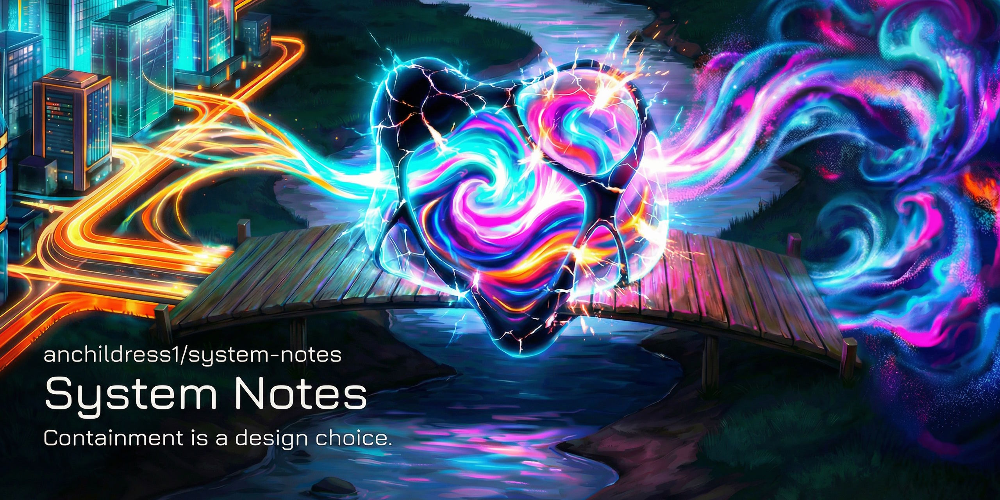

<!-- Build & Status -->

[](https://github.com/anchildress1/system-notes/actions/workflows/ci.yml)  

<!-- Tech Stack -->

    
     

# System Notes

Welcome to the digital nervous system of my professional existence. This isn't a static portfolio or a dusty résumé; it's a living, breathing, and occasionally glittering map of what I've built, broken, and fixed.

System Notes treats projects like evolving organisms rather than finished artifacts. It acknowledges that "finished" is a myth and that the relationships between projects are often more interesting than the projects themselves. It is built to be queried, explored, and poked at.

It is **Incomplete by Design**.

## The Architecture

[Read the full System Architecture](./ARCHITECTURE.md)

This monorepo houses the full stack of the system:

- **apps/web**: The face. A Next.js frontend that believes in "More Sparkles, More Problems" but handles them anyway.
- **apps/api**: The brain. A FastAPI service that talks to LLMs so you don't have to guess what I was thinking.

## Quick Start

We use a `Makefile` to keep things civilized.

```bash
# Setup everything (Node + Python + vibes)
make setup

# Run the development environment (Frontend + Backend)
make dev

# Run all the checks because you care about quality
make ai-checks
```

## Performance & Accessibility

Recent updates have focused on creating an experience that is both **lightning-fast for users** and **transparently readable for AI agents**.

- **Optimized Assets**: Audio and visual assets are lazy-loaded or pre-loaded intelligently to respect user bandwidth (especially on mobile).
- **Interactive Glitter**: Particle effects are batched and scaled based on device capabilities, ensuring high-fidelity fun without the frame drops.
- **AI-Ready Context**: System prompts and project data are structured to be ingested by LLMs, making this entire repository a queryable knowledge base.

This aims to provide **AI accessible info at a speed users can enjoy**, without overloading the developer (me) or your browser.

## Mine. Read Before You Get Ideas. ⚖️

This project is my work and it’s licensed under the [PolyForm Shield License 1.0.0](./LICENSE).

**Fork it?** Absolutely.  
**Learn from it?** Please do.  
**Monetize it?** Absolutely not.

If you’re selling it, bundling it, or otherwise profiting from my late-night coding sessions, we’re going to have a problem. Keep it open, keep it personal, and we'll be fine.
