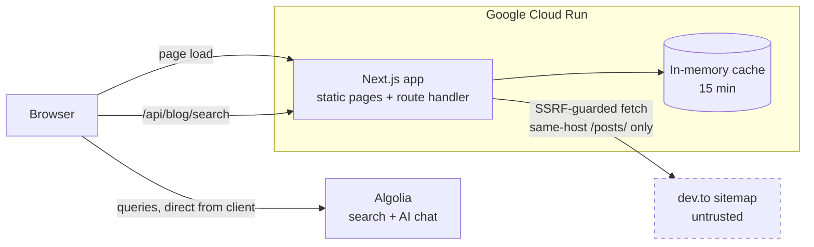

[](https://github.com/anchildress1/system-notes/actions/workflows/ci.yml) [](https://sonarcloud.io/summary/new_code?id=anchildress1_system-notes) 

<!--START_SECTION:rai-badge-->

<!--END_SECTION:rai-badge-->

_That badge is [rai-commit-badge](https://github.com/anchildress1/rai-commit-badge) scoring this repo's own git history: the share of commits carrying an RAI attribution footer since the first one landed. Dependabot bumps and release automation sit in that denominator without footers, so it reads as adoption across the whole history rather than a claim about any single commit._

# System Notes

Welcome to the digital nervous system of my professional existence. This isn't a static portfolio or a dusty résumé; it's a living, breathing, and occasionally glittering map of what I've built, broken, and fixed.

System Notes treats projects like evolving organisms rather than finished artifacts. It acknowledges that "finished" is a myth and that the relationships between projects are often more interesting than the projects themselves. It is built to be queried, explored, and poked at.

It is **Incomplete by Design**.

---

## Table of Contents

- [What It Actually Does](#what-it-actually-does)
- [Tech Stack](#tech-stack)
- [The Architecture](#the-architecture)
- [Project Structure](#project-structure)
- [Quick Start](#quick-start)
- [Configuration](#configuration)
- [Performance & Accessibility](#performance--accessibility)
- [Security](#security)
- [Contributing](#contributing)
- [Mine. Read Before You Get Ideas. ⚖️](#mine-read-before-you-get-ideas-️)
- [Author](#author)

---

## What It Actually Does

- **Search that thinks**: Algolia-powered search and AI chat, running straight from the browser — no server round-trip, no backend waiting to fall over.
- **A project index that flips**: Every project lives on a 3D flip card instead of a spreadsheet-shaped list.
- **Blog, aggregated**: Pulls and caches posts from my DEV blog through an SSRF-guarded route handler, so the portfolio has fresh writing without blindly trusting the internet.
- **Built for machines too**: Structured, queryable data (project cards, system prompts, a generated `/site.jsonld`) so an LLM can actually parse this repo, not just a human.
- **Fast on purpose**: Lighthouse gates block the pre-push hook. If it's slow, it doesn't ship.

---

## Tech Stack

| Layer         | Tools                                                                             |
| ------------- | --------------------------------------------------------------------------------- |
| Framework     | Next.js, React, TypeScript                                                        |
| Search & AI   | Algolia, `react-instantsearch`                                                    |
| UI & Motion   | Tailwind CSS, Framer Motion, PixiJS                                               |
| Images        | `sharp`, build-time responsive variants (no runtime optimizer)                    |
| Testing       | Vitest, Testing Library, Playwright, axe-core                                     |
| Quality Gates | ESLint, Prettier, Lefthook, Commitlint (+ `commitlint-plugin-rai`), Lighthouse CI |
| Infra & CI/CD | Google Cloud (Cloud Run), GitHub Actions, Release Please                          |

---

## The Architecture

[Read the full System Architecture](./ARCHITECTURE.md)

One Next.js app, no backend to babysit. The browser talks to Algolia directly; the only server-side fetch is the blog aggregator, and it treats the sitemap as hostile.


```mermaid
flowchart LR
    accTitle: System Notes architecture
    accDescr: A browser loads one Next.js app on Cloud Run. Search and AI chat call Algolia directly from the browser, while a single route handler fetches and caches the DEV blog sitemap server-side behind an SSRF guard.

    Browser["Browser"]

    subgraph CloudRun["Google Cloud Run"]
        App["Next.js app<br/>static pages + route handler"]
        Cache[("In-memory cache<br/>15 min")]
    end

    Algolia["Algolia<br/>search + AI chat"]
    Dev["dev.to sitemap<br/>untrusted"]

    Browser -->|"page load"| App
    Browser -->|"queries, direct from client"| Algolia
    Browser -->|"/api/blog/search"| App
    App --> Cache
    App -->|"SSRF-guarded fetch<br/>same-host /posts/ only"| Dev

    style Dev stroke-dasharray: 5 5
```

---

## Project Structure

```text
├── src/
│   ├── app/              # Next.js App Router — pages, route handlers, sitemap, /site.jsonld
│   ├── components/       # UI components, each with its tests and CSS module alongside
│   ├── data/             # projects.json and generated image manifest
│   ├── lib/              # Shared logic: Algolia creds, image loader, JSON-LD builder
│   ├── hooks/ utils/     # Reusable behaviour and helpers
│   └── styles/ types/    # Design tokens and shared type definitions
├── public/               # Static assets; source images live here, variants in opt/
├── scripts/              # Build-time generators (responsive image variants + LQIP blurs)
├── tests/                # Playwright end-to-end specs
└── .github/workflows/    # ci.yml, sonar.yml, release-please.yml, rai-badge.yml
```

Unit tests sit next to the code they cover; only end-to-end specs live in `tests/`.

---

## Quick Start

We use a `Makefile` to keep things civilized.

```bash
# Setup everything (Node + vibes)
make setup

# Run the development environment
make dev

# Run all the checks because you care about quality
make ai-checks
```

Responsive image variants are generated from `public/` and are gitignored. Every target that
compiles the app builds them first, so there is no separate step to remember.

---

## Configuration

Copy the keys below into a local `.env`. Everything prefixed `NEXT_PUBLIC_` is embedded in the
client bundle at build time — never put a secret behind that prefix.

| Variable                                     | Required | What it does                                                                        |
| -------------------------------------------- | -------- | ----------------------------------------------------------------------------------- |
| `NEXT_PUBLIC_ALGOLIA_APPLICATION_ID`         | Yes      | Algolia app the browser queries                                                     |
| `NEXT_PUBLIC_ALGOLIA_SEARCH_API_KEY`         | Yes      | Search-only key. Safe to ship; it cannot write                                      |
| `NEXT_PUBLIC_ALGOLIA_SEARCH_INDEX_NAME`      | Yes      | Index backing the search page                                                       |
| `NEXT_PUBLIC_ALGOLIA_SUGGESTIONS_INDEX_NAME` | No       | Query-suggestions index, if one exists                                              |
| `NEXT_PUBLIC_ALGOLIA_AGENT_ID`               | No       | Algolia AI agent powering chat                                                      |
| `NEXT_PUBLIC_ALGOLIA_SEARCH_AI_ID`           | No       | Algolia AI search identifier                                                        |
| `NEXT_PUBLIC_BASE_URL`                       | No       | Canonical origin for metadata, sitemap and JSON-LD. Defaults to the production host |
| `ANALYZE`                                    | No       | Set to `true` with `npm run build:analyze` for a bundle report                      |

Admin and write-scoped Algolia keys are used only for indexing from outside the app. They are
never read by anything under `src/`, and they must not be given a `NEXT_PUBLIC_` prefix.

---

## Performance & Accessibility

Recent updates have focused on creating an experience that is both **lightning-fast for users** and **transparently readable for AI agents**.

- **Images cost nothing at runtime**: every responsive variant is encoded at build time and served as a static file. The runtime image optimizer is gone — the route does not exist in the build.
- **Interactive Glitter**: Particle effects are batched and scaled based on device capabilities, ensuring high-fidelity fun without the frame drops.
- **AI-Ready Context**: System prompts, project data and a generated `/site.jsonld` are structured to be ingested by LLMs, making this entire repository a queryable knowledge base.

Lighthouse gates run pre-push and in CI: accessibility, best-practices and SEO must all hit 100,
performance must clear 98 on desktop and 92 on mobile.

---

## Security

Untrusted input gets treated like it's untrusted. The blog-aggregation route handler only follows same-host, allowlisted sitemap URLs (SSRF guard). If local file serving is ever added, served file types must be allowlisted to `.md`/`.json`/`.txt`, and user-controlled path input must be rejected outright rather than sanitized. Full policy: [`SECURITY_RULES.md`](./SECURITY_RULES.md).

Secrets never touch the repo — `gitleaks` and Lefthook's pre-commit hook see to that before a commit ever lands. Dependabot, CodeQL, Semgrep and SonarCloud all run against every pull request.

---

## Contributing

This is a personal portfolio, not a project hunting for maintainers — but if you have spotted a
bug or want to suggest something, open an issue.

If you do send a pull request:

- Branch off `main`; nothing lands on `main` directly.
- [Conventional Commits](https://www.conventionalcommits.org/), enforced by commitlint.
- Commits need an RAI attribution footer and a `Signed-off-by` line. `commitlint-plugin-rai`
  will reject the commit if AI wrote part of it and the footer does not say so. That is the
  point — it is the same rule that produces the badge at the top.
- `make ai-checks` must pass before you push. The pre-push hook runs it anyway.

---

## Mine. Read Before You Get Ideas. ⚖️

This project is my work and it’s licensed under the [PolyForm Shield License 1.0.0](./LICENSE).

**Fork it?** Absolutely.
**Learn from it?** Please do.
**Monetize it?** Absolutely not.

If you’re selling it, bundling it, or otherwise profiting from my late-night coding sessions, we’re going to have a problem. Keep it open, keep it personal, and we'll be fine.

---

## Author

**Ashley Childress** — [GitHub](https://github.com/anchildress1) · [LinkedIn](https://linkedin.com/in/anchildress1) · [DEV.to](https://dev.to/anchildress1)
