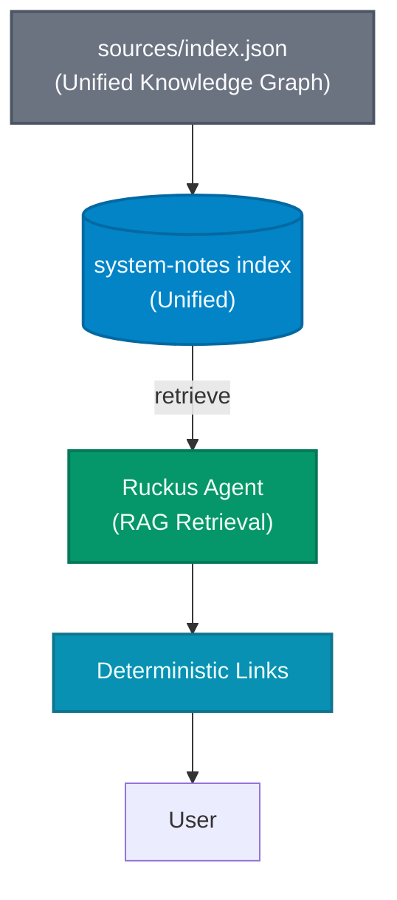

# Algolia Index Configuration

This folder tracks all Algolia index settings for reproducibility.

## Indices

- **`system-notes`** — Unified index containing "fact" objects and narrative records (Identity, Principles, Projects, etc.) for targeted retrieval.

## Files

- `sources/` — Source of truth JSON files (`index.json`).
- `config/` — Index settings and synonym files (`settings.json`, `synonyms.json`).
- `algolia_prompt.md` — The unified system prompt for the agent.

## Searchable Attributes (Tier Order)

### `system-notes`

1. `title`
2. `blurb`
3. `fact`
4. `tags`
5. `entities`

## Architecture Diagrams

### System Flow: Source → Algolia → Agent → User



## Upload Workflow

The primary upload method is via the python script:

```bash
# Upload to Algolia (Enrichment happens in-memory)
python3 apps/api/scripts/index_algolia.py
```

## Credentials

Stored in `.env`:

```
ALGOLIA_APPLICATION_ID=EXKENZ9FHJ
ALGOLIA_ADMIN_API_KEY=<redacted>
```

**Never commit credentials to git.**
