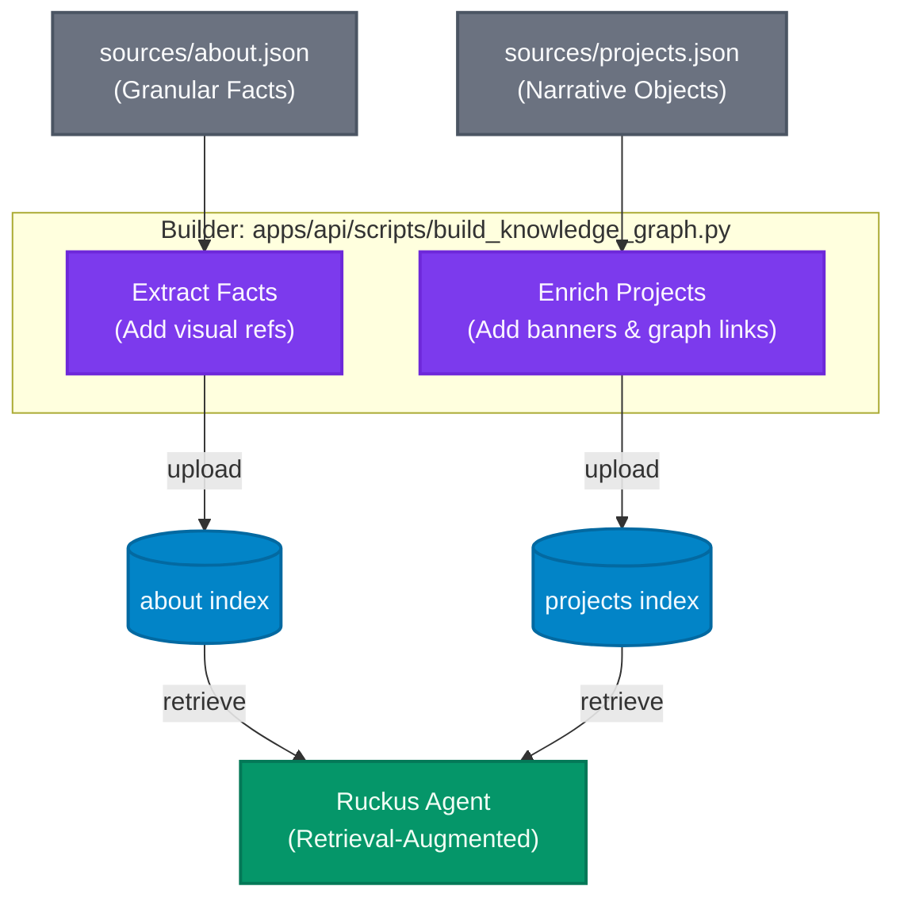

# Algolia Index Configuration

This folder tracks all Algolia index settings for reproducibility.

## Indices

- **`projects`** — 9 records, single granular objects with narrative fields (`what_it_is`, `why_it_exists`).
- **`about`** — ~6 records, granular "fact" objects (Identity, Principles, etc.) for targeted retrieval.
- **`blog_posts`** — 56 records, fetched from sitemap.

## Files

- `sources/` — Source of truth JSON files (`about.json`, `projects.json`).
- `config/` — Index settings and synonym files (`projects_settings.json`, `about_settings.json`).
- `build/` — Generated artifacts (enriched with visual refs and graph connections) ready for upload.
- `algolia_prompt.md` — The unified system prompt for the agent.

## Searchable Attributes (Tier Order)

### `projects`

1. `name`
2. `aliases`
3. `what_it_is`
4. `why_it_exists`
5. `tech_stack`

### `about`

1. `title`
2. `tags`
3. `content` (the raw JSON data of the fact)

### `blog_posts`

1. `title`
2. `excerpt`
3. `tags`

## Architecture Diagrams

### System Flow: Source → Algolia → Agent → User



## Upload Workflow

The primary upload method is via the python scripts:

```bash
# 1. Build artifacts from sources
python3 apps/api/scripts/build_knowledge_graph.py

# 2. Upload to Algolia
python3 apps/api/scripts/index_algolia.py
```

## Credentials

Stored in `.env`:

```
ALGOLIA_APPLICATION_ID=EXKENZ9FHJ
ALGOLIA_ADMIN_API_KEY=<redacted>
```

**Never commit credentials to git.**
