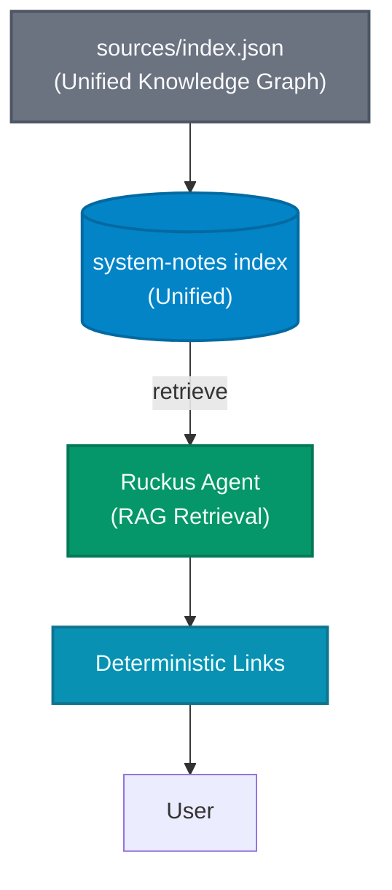

# Algolia Search Configuration

This directory contains the configuration and source data for the **System Notes** Algolia search index.

## 📂 Directory Structure

We use a consolidated structure for the unified `system-notes` index:

```
apps/api/algolia/
├── sources/             # Source of truth JSON files (index.json)
├── config/              # Index settings and synonym files (settings.json, synonyms.json)
├── diagrams/            # Architecture diagrams
└── scripts/             # Python indexing scripts (in ../scripts/)
```

## 🧠 Index Schema

The `system-notes` index uses a **Granular Fact Architecture**. Instead of indexing full pages, we index atomic "facts" or "narratives" to enable precise retrieval.

### Searchable Attributes (Tier Order)

1. `title`
2. `blurb`
3. `fact`
4. `tags`
5. `entities`

### Faceting & Filtering Attributes

| Attribute            | Type     | Description                                                        |
| :------------------- | :------- | :----------------------------------------------------------------- |
| `facet_domain`       | `string` | High-level domain: `work_style`, `philosophy`, `about`, etc.       |
| `facet_category`     | `string` | Sub-category: `principles`, `workflow`, `background`, etc.         |
| `entities`           | `array`  | Related projects or entities: `System Notes`, `Hermes Agent`, etc. |
| `tags`               | `array`  | Thematic tags: `architecture`, `ux`, `performance`                 |
| `facet_signal_level` | `number` | Priority/Relevance signal: `1` (High), `2` (Med), `3` (Low)        |

## 🚀 Indexing Workflow

Indexing is handled by the `apps/api/scripts/index_algolia.py` script.

1.  **Load Source**: Reads `sources/index.json`.
2.  **Apply Settings**: Reads `config/settings.json` and `config/synonyms.json`.
3.  **Atomic Replace**: Performs a zero-downtime atomic replacement of the index.

### Command

```bash
# Run via Makefile (from root)
make index-algolia
```

## Architecture Diagrams

### System Flow: Source → Algolia → Agent → User



## Credentials

Stored in `.env`:

```
NEXT_PUBLIC_ALGOLIA_APPLICATION_ID=...
ALGOLIA_ADMIN_API_KEY=...
```

**Never commit credentials to git.**
