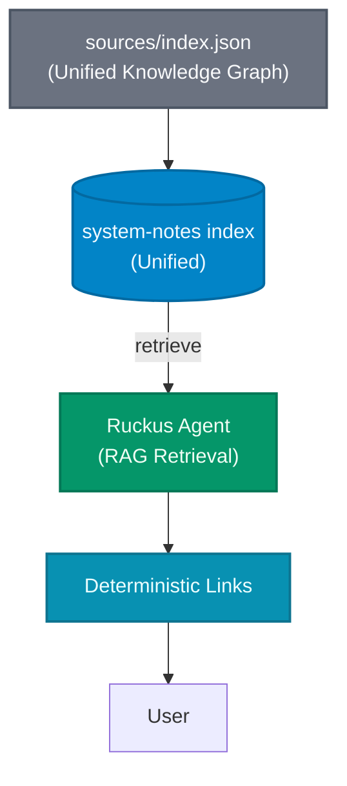

# Algolia Search Configuration

This directory contains the configuration and source data for the **System Notes** Algolia search index.

## 📂 Directory Structure

We use a consolidated structure for the unified `system-notes` index:

```
apps/api/algolia/
├── sources/             # Consolidated data and configuration
│   ├── index.json       # The Master Knowledge Graph (facts, narratives, projects)
│   ├── settings.json    # Searchable attributes, faceting, ranking
│   └── synonyms.json    # Synonym definitions
├── diagrams/            # Architecture diagrams
└── scripts/             # Python indexing scripts (in ../scripts/)
<<<<<<< HEAD
```

## 🧠 Index Schema

The `system-notes` index uses a **Granular Fact Architecture**. Instead of indexing full pages, we index atomic "facts" or "narratives" to enable precise retrieval.

### Core Attributes

| Attribute  | Description                                                  |
| :--------- | :----------------------------------------------------------- |
| `objectID` | Unique identifier (e.g., `fact-001`, `project-system-notes`) |
| `title`    | Title of the context (e.g., "Algolia Integration")           |
| `fact`     | The core atomic content/statement                            |
| `blurb`    | Short description or summary (for projects/narratives)       |

### Faceting & Filtering Attributes

| Attribute  | Type     | Description                                                     |
| :--------- | :------- | :-------------------------------------------------------------- |
| `category` | `string` | High-level domain: `Work Style`, `Philosophy`, `Projects`, etc. |
| `projects` | `array`  | Related projects: `System Notes`, `Hermes Agent`, etc.          |
| `tags`     | `array`  | Thematic tags: `Architecture`, `UX`, `Performance`              |
| `signal`   | `number` | Priority/Relevance signal (higher is more relevant)             |

## 🚀 Indexing Workflow

Indexing is handled by the `apps/api/scripts/index_algolia.py` script.

1.  **Load Source**: Reads `sources/index.json`.
2.  **Apply Settings**: Reads `sources/settings.json` and `sources/synonyms.json`.
3.  **Atomic Replace**: Performs a zero-downtime atomic replacement of the index.

### Command

```bash
# Run via Makefile (from root)
make index-algolia
```

## 🏗️ Architecture

### System Flow: Source → Algolia → Agent → User


```mermaid
graph TB
    accTitle: Algolia System Data Flow
    accDescr: Data flow showing how the Python script enriches JSON data with graph context before indexing

    %% Data sources
    UnifiedJSON["sources/index.json<br/>(Unified Knowledge Graph)"]:::source

    %% Algolia indices
    UnifiedIndex[("system-notes index<br/>(Unified)")]:::index

    %% Retrieval
    Ruckus["Ruckus Agent<br/>(RAG Retrieval)"]:::agent

    %% Link generation
    Links["Deterministic Links"]:::output

    %% Flow
    UnifiedJSON --> UnifiedIndex
    UnifiedIndex -->|retrieve| Ruckus

    Ruckus --> Links
    Links --> User

    %% Styles
    classDef source fill:#6b7280,stroke:#4b5563,stroke-width:2px,color:#f9fafb
    classDef process fill:#7c3aed,stroke:#6d28d9,stroke-width:2px,color:#faf5ff
    classDef index fill:#0284c7,stroke:#0369a1,stroke-width:2px,color:#f0f9ff
    classDef agent fill:#059669,stroke:#047857,stroke-width:2px,color:#f0fdf4
    classDef output fill:#0891b2,stroke:#0e7490,stroke-width:2px,color:#ecfeff
```

## 🔐 Credentials

Stored in `.env` (not committed):

```
ALGOLIA_APPLICATION_ID=...
ALGOLIA_ADMIN_API_KEY=...
```

**Never commit credentials to git.**

```

```
