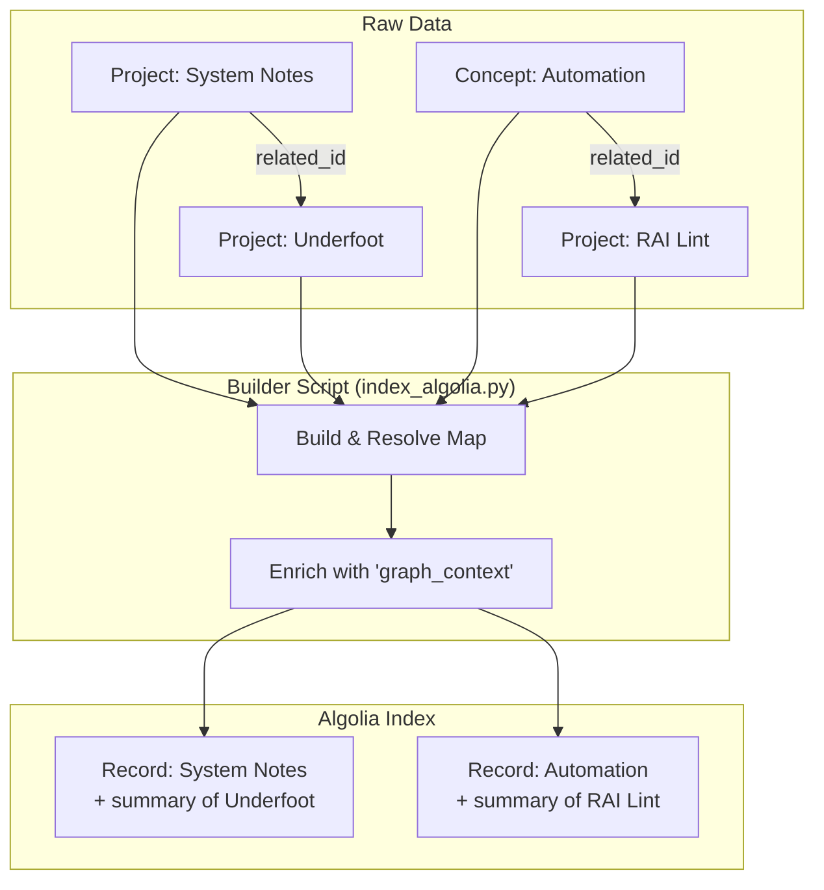
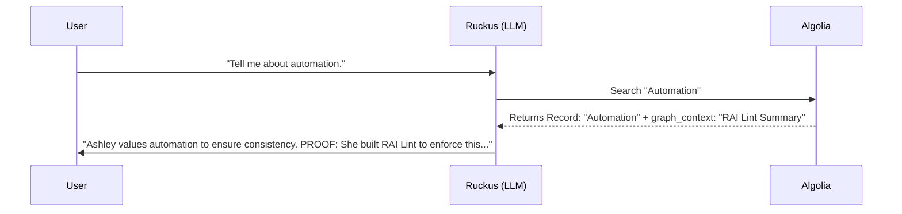

# Graph RAG Architecture: The Spiderweb Workflow

## The Concept: "Index Grows, Prompt Shrinks"

The skepticism about "Agents" usually stems from their non-determinism: _Will it decide to search again? Will it find the right link?_
We replaced the **Agent (Loop)** with a **Workflow (Pipeline)**.

Instead of asking the LLM to "find connections" at query time (slow, fragile), we **bake the connections into the index** at build time (fast, deterministic).

## 1. The Builder (Index Time)

This is where the magic happens. We denormalize the graph.
Each record effectively "swallows" the summaries of its neighbors.

## 2. The Workflow (Query Time)

Because the context is pre-baked, the runtime is **O(1)** (One Search).

## Why This Works (Addressing Skepticism)

### 1. Latency & Reliability

- **Old:** 2+ API calls. If the first fails or the LLM "forgets" to search again, the answer is incomplete.
- **New:** 1 API call. The context is **attached** to the result. It is impossible to get the "Concept" without also getting the "Proof".

### 2. Determinism

- **Old:** relying on the AI to _infer_ that "Underfoot" is related to "System Notes".
- **New:** You explicitly defined `related_project_ids`. The connection is **hardcoded**. The AI just summarizes what you told it.

### 3. Context Window Efficiency

- We don't dump the _entire_ database into the context.
- We only dump the **Local Neighborhood** (The Spiderweb) of the specific node the user asked about.
