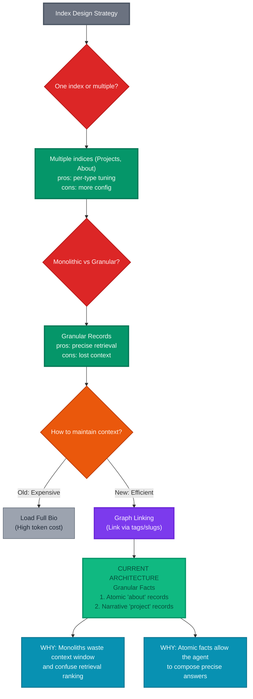

# Algolia Index Design Rationale

This diagram explains the design evolution: from strict normalization to a **Granular Fact Architecture**.
We split monolithic biographies into atomic facts to enable precise RAG retrieval without loading irrelevant context.

