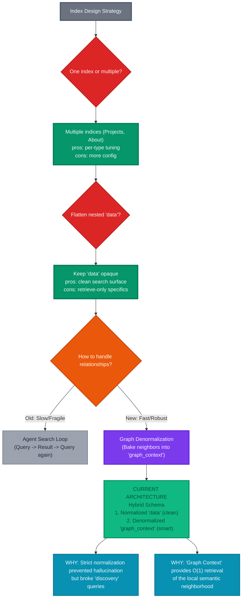

# Algolia Index Design Rationale

This diagram explains the design evolution: from strict normalization to a **Hybrid Graph Architecture**.
We maintain a clean schema but "bake" (denormalize) the graph context to enable single-shot retrieval.

