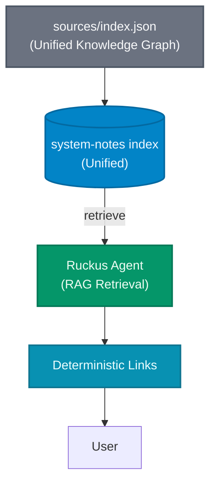

# Algolia System Data Flow

End-to-end flow from JSON source files through the **Graph Enrichment Script** to Algolia and the Agent.

```mermaid
graph TB
    accTitle: Algolia System Data Flow
    accDescr: Data flow showing how the Python script enriches JSON data with graph context before indexing

    %% Data sources
    UnifiedJSON["sources/index.json<br/>(Unified Knowledge Graph)"]:::source

    %% Algolia indices
    UnifiedIndex[("system-notes index<br/>(Unified)")]:::index

    %% Retrieval
    Ruckus["Ruckus Agent<br/>(RAG Retrieval)"]:::agent

    %% Link generation
    Links["Deterministic Links"]:::output

    %% Flow
    UnifiedJSON --> UnifiedIndex
    UnifiedIndex -->|retrieve| Ruckus

    Ruckus --> Links
    Links --> User

    %% Styles
    classDef source fill:#6b7280,stroke:#4b5563,stroke-width:2px,color:#f9fafb
    classDef process fill:#7c3aed,stroke:#6d28d9,stroke-width:2px,color:#faf5ff
    classDef index fill:#0284c7,stroke:#0369a1,stroke-width:2px,color:#f0f9ff
    classDef agent fill:#059669,stroke:#047857,stroke-width:2px,color:#f0fdf4
    classDef output fill:#0891b2,stroke:#0e7490,stroke-width:2px,color:#ecfeff
```
