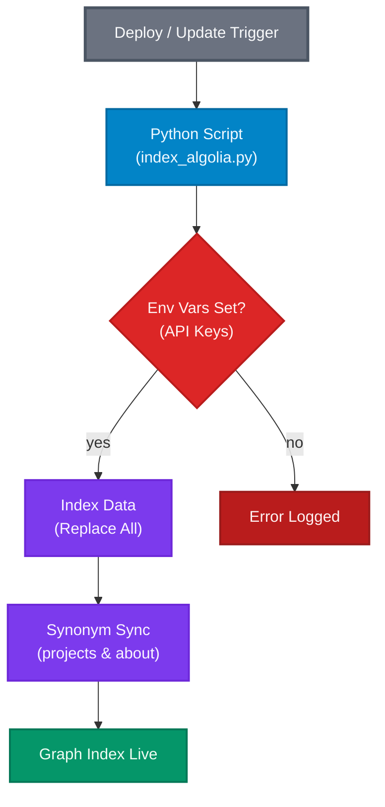

# Algolia Upload Workflow

The Single Source of Truth for indexing is the **Python Script** (`apps/api/scripts/index_algolia.py`).
We do not use manual dashboard uploads or MCP tools for production data to ensure graph consistency.

